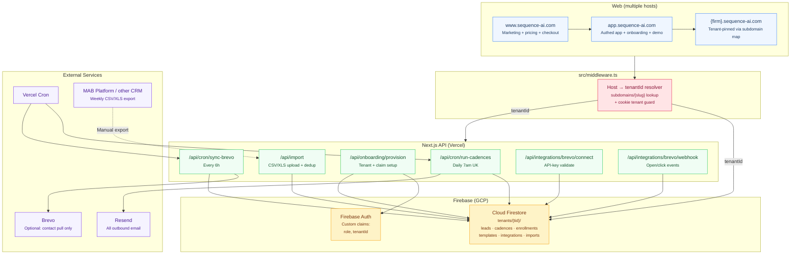
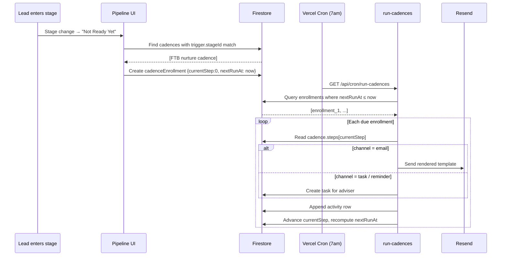
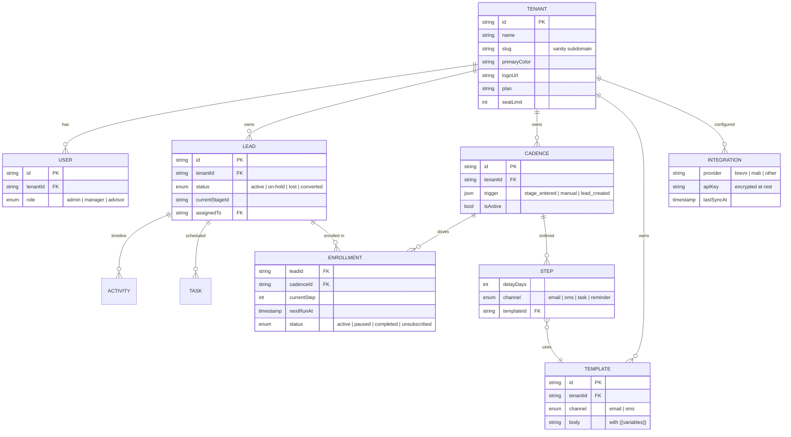

# Sequence

> Lead nurturing and follow-up for UK mortgage advisers. Bolts on to whatever you already use — MAB Platform, FLG, Dashly, Intelligent Office — without replacing it.

`www.sequence-ai.com` (marketing) · `app.sequence-ai.com` (app) · vanity subdomains per firm (e.g. `mallard.sequence-ai.com`, `friendscapital.sequence-ai.com`)

## The problem we solve

Prospects who enquire but aren't transaction-ready — first-time buyers still saving a deposit, self-employed clients building accounts history, remortgages months out — fall through the cracks. Advisers note "contact again in January", but there's no structured process to make sure the follow-up happens. A standalone CRM is overkill (and expensive) for firms whose primary system is fine for in-flight cases. They just need the nurture layer.

Sequence is that layer. It plugs into existing data sources, runs cadences automatically, and gives the owner at-a-glance visibility on where every prospect sits and what the next action is.

## What's inside

- **Pipeline (Kanban + list)** with a first-class "Not Ready Yet" stage — the column where most leads currently die.
- **Cadences** — multi-step automations (Day 0 email, Day 7 SMS, Day 30 reminder) tied to stage changes or triggered manually. Three starter cadences seeded per firm: FTB deposit-saving, remortgage warm-up, cold re-engagement.
- **Activity logging** — call, email, meeting, note, SMS, WhatsApp. One-click quick-log on the lead page; full timeline on every prospect.
- **Email/SMS templates** with variables. Templates feed both cadences and ad-hoc activity logging.
- **Daily reminder cron** — Resend emails to up to 3 recipients with full prospect context, deep-linking back into the lead.
- **MAB CSV/XLS import** with auto column-mapping and duplicate detection.
- **Brevo connector** *(opportunistic)* — one-way pull of contacts and email open/click events into the activity timeline. Resend stays as the send engine.
- **Self-serve onboarding** — firm details → invite team → connect data source → import → pick starter cadences.
- **Multi-tenant demo** — `app.sequence-ai.com/demo` switches between Mallard, Friends Capital, and Acme so prospects can feel the product.

**Optimised for laptop-first usage.** Owners and advisers do most of their work at a desk: pipeline kanban, multi-column lead forms, manager dashboards, and table views are designed for ≥1280px. Mobile is secondary — kept for what it's actually good at: quick lead capture between appointments and tap-to-call from a "today" follow-up list.

## Pricing

£50 / month for 5 users. £8 / month per additional user. All features included. 14-day free trial. See `/pricing`.

## Tech stack

| Layer | Tech |
|---|---|
| Framework | Next.js 15 (App Router, TypeScript), React 19 |
| Database | Firebase Firestore — multi-tenant under `tenants/{tid}/...` |
| Auth | Firebase Auth + custom claims (`role`, `tenantId`) |
| Email | Resend (always — Brevo is read-only) |
| Cron | Vercel Cron — `run-cadences` daily 7am UK, `sync-brevo` every 6h |
| Hosting | Vercel; wildcard subdomain routing via `src/middleware.ts` |
| Styling | Tailwind v4 |
| Validation | Zod (shared client/server) |
| Real-time | Firestore `onSnapshot` |
| Import | SheetJS (`xlsx`) |
| Drag and drop | `@hello-pangea/dnd` |

See [`CLAUDE.md`](./CLAUDE.md) for the codebase contract — tenant rules, cadence engine, Brevo principles, branding rules, and conventions.

## Local development

```bash
cp .env.local.example .env.local      # fill in Firebase + Resend + (optional) Brevo keys
npm install
npm run dev
```

Visit:
- `http://localhost:3000` — marketing landing.
- `http://localhost:3000/demo` — multi-tenant demo switcher.
- `http://localhost:3000/onboarding` — onboarding wizard.

For local vanity-subdomain testing, add to `/etc/hosts`:
```
127.0.0.1 mallard.localhost
127.0.0.1 friendscapital.localhost
127.0.0.1 acme.localhost
```

## System architecture



## Cadence run flow



## Tenant data model



## UK mortgage industry notes

- UK terminology: deposit (not down payment), remortgage (not refinance), adviser (not agent).
- Self-employment: years trading, SA302, accountant details — prominent in the qualification view.
- Credit profile: factual non-judgemental language for CCJs, defaults, IVAs.
- Long nurture cycles are normal — 6–12 month follow-ups, plus annual remortgage warm-ups, are first-class.
- FCA: 6-year retention, GDPR/UK DPA 2018, soft delete + hard purge.

## Reference: Mallard case study

Mallard Mortgages (Sheffield) is the founding tenant. UI mockups for their specific screens live in `pencil-welcome-desktop.pen` (Pencil/Lunaris design system). The screen map below is reference only — Sequence's actual visual design generalises these screens for any firm.

| # | Screen | Node ID | Persona | Layout |
|---|--------|---------|---------|--------|
| 1 | Manager Dashboard | `00PCT` | Della (owner) | Desktop |
| 2 | My Day | `xLorR` | Adviser | Desktop |
| 3 | Pipeline Kanban | `yuS5D` | Della | Desktop |
| 4 | My Day | `S14Wd` | Adviser | Mobile |
| 5 | New Lead Form | `oluoT` | Adviser | Desktop |
| 6 | Quick Capture | `gJmkX` | Adviser (field) | Mobile |
| 7 | Prospect Detail | `CHnFT` | Adviser | Desktop |
| 8 | Pipeline List | `xNuto` | Adviser (field) | Mobile |
| 9 | MAB Import | `oaR0H` | Della | Desktop |
| 10 | Manager Dashboard | `bO6Pj` | Della | Mobile |

---

Built by Storyboard Digital / Legacy Labs.
