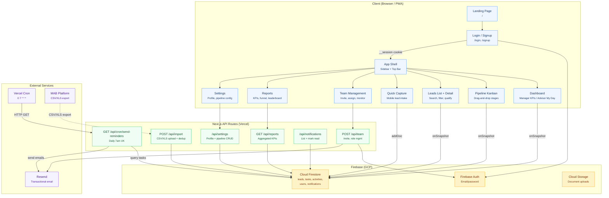
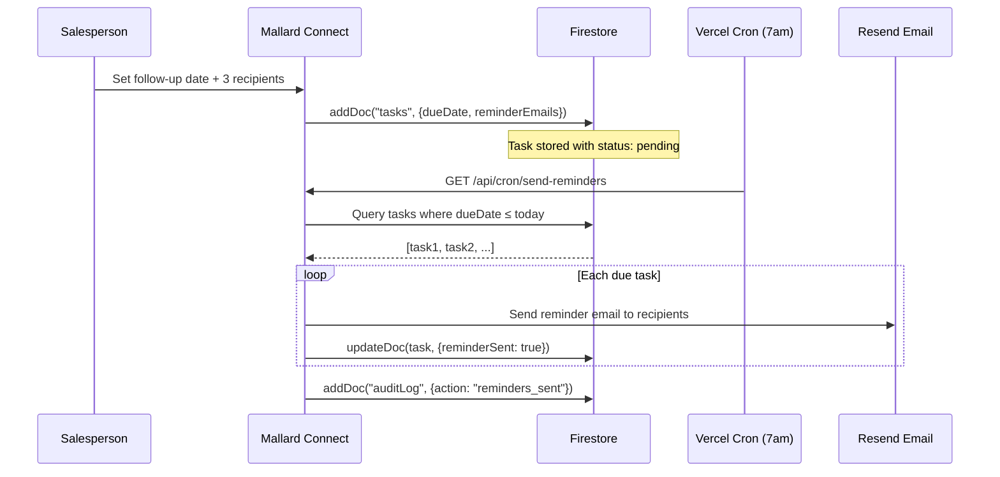
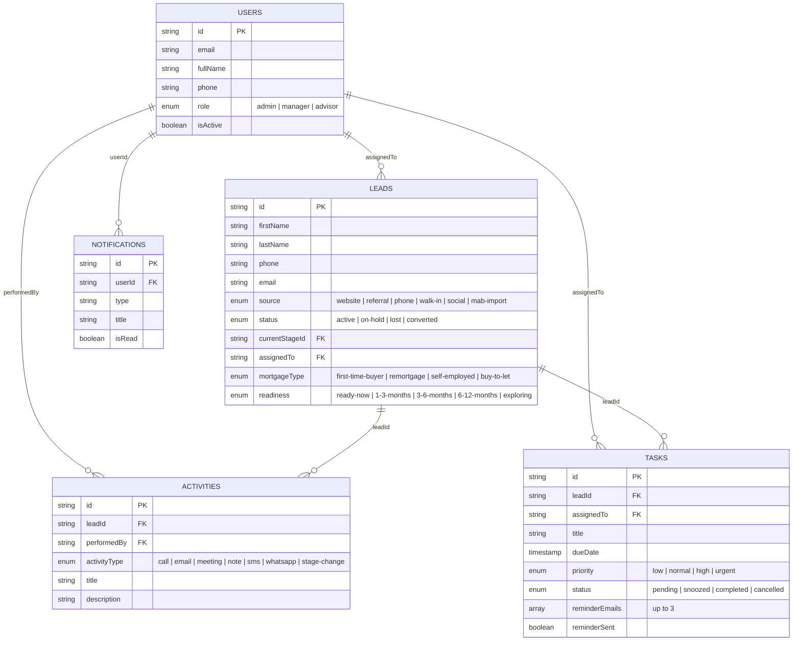

# Mallard Connect

> Lead nurturing and follow-up system for Mallard Mortgages, Sheffield UK.
> Works alongside the Mortgage Advice Bureau "Platform" system.

## The Problem

Prospects who enquire but aren't ready to proceed — like a first-time buyer still saving for a deposit, or a self-employed client building their accounts history — are falling through the cracks. Advisers might note down "contact again in January," but there's no structured process to make sure that follow-up actually happens.

Mallard Connect solves this by providing structured follow-up reminders, pipeline visibility, and team coordination — all without replacing their existing MAB Platform system.

## Design System

All UI mockups are designed in `pencil-welcome-desktop.pen` using the Lunaris design system with KokonutUI-inspired components. The design uses a **bold & energetic** aesthetic with:

- **Primary**: Dark teal (Mallard duck inspired)
- **Accent**: Amber/gold (energetic CTAs, overdue alerts)
- **Success**: Green (completed, on track)
- **Destructive**: Red (overdue, errors)
- **Clean white backgrounds** with subtle card elevation

---

## User Experience by Persona

### Della (Owner/Manager)

Della needs to see everything at a glance — pipeline health, team performance, and which leads need attention. She can monitor without micromanaging.

#### Manager Dashboard (Desktop)

Full-width desktop view with sidebar navigation showing all manager-level sections. Features:

- **4 KPI cards** at the top: New Leads, Follow-ups Due, Overdue, Deals Closed
- **Pipeline Health** horizontal bar chart showing lead counts across all 6 active stages
- **Team Activity** live feed showing recent actions by salespeople (calls logged, stages changed, leads created)
- Real-time updates via Firestore `onSnapshot` — Della sees activity as it happens

*Screen: `00PCT` in pencil-welcome-desktop.pen*

#### Manager Dashboard (Mobile)

Same data optimized for Della's phone — compact KPI pills, team scorecard cards with avatar + stats per salesperson, and a condensed activity feed. Bottom tab nav with Dashboard active and FAB for quick actions.

*Screen: `bO6Pj` in pencil-welcome-desktop.pen*

#### Pipeline Board (Desktop Kanban)

Drag-and-drop Kanban board with 6 visible stage columns:

| Stage | Color | Purpose |
|-------|-------|---------|
| New Enquiry | Indigo | Just came in, not yet contacted |
| Initial Contact | Blue | First conversation happened |
| **Not Ready Yet** | **Amber (highlighted)** | **THE key stage — where leads currently fall through cracks** |
| Nurturing | Green | Active follow-up cycle |
| Ready to Proceed | Blue | Prospect ready for handoff |
| Referred to MAB | Purple | Handed to MAB Platform for formal application |

Each prospect card shows: name, type (FTB/remortgage/self-employed), assigned salesperson avatar, time context, and overdue badges in red.

The "Not Ready Yet" column has a **highlighted amber border** — this is the most important stage for Mallard, where the system earns its keep.

*Screen: `yuS5D` in pencil-welcome-desktop.pen*

#### MAB Platform Import (Desktop)

Bridge to their existing system. Della exports CSV/XLS from MAB Platform and uploads it:

1. **Upload area** with drag-and-drop, showing file name and row count confirmation
2. **Column mapping table** auto-mapping MAB columns (Client Name, Tel Number, Email Address, Adviser, Case Status) to Mallard Connect fields
3. **Deduplication preview** with three color-coded buckets:
   - **Green (42)**: New leads — will be created
   - **Amber (8)**: Duplicates — will be skipped (existing record is newer)
   - **Blue (3)**: Duplicates — can be updated (incoming has newer data), with merge toggles

The column mapper remembers mappings from the last import. Phone normalization handles +44 prefix and spacing variations.

*Screen: `oaR0H` in pencil-welcome-desktop.pen*

---

### Salespeople (Office/Desktop)

Salespeople need clarity on what to do today and fast lead capture. No ambiguity, no leads slipping through.

#### "My Day" Dashboard (Desktop)

The salesperson's home screen. Shows:

- **Greeting** with motivational nudge ("You have 3 follow-ups due today. Let's perform!")
- **Today's Follow-ups** — cards with prospect name, phone number (tap-to-call on mobile), context blurb, and status badges (Overdue/Due today/Planned)
- **My Pipeline** summary — stage counts at a glance
- **New Assignments** — leads Della has assigned, with context

*Screen: `xLorR` in pencil-welcome-desktop.pen*

#### New Lead Form (Desktop)

Two-column layout for capturing leads in under 60 seconds:

**Left column — Contact Details:**
- First/Last Name, Phone, Email
- Lead Source (dropdown: website, referral, phone, walk-in, social)
- Mortgage Type (dropdown: first-time buyer, remortgage, self-employed, buy-to-let)
- Readiness (dropdown: ready now, 1-3 months, 3-6 months, 6-12 months, exploring)
- Quick Notes (textarea)

**Right column — Follow-up Reminder:**
- Follow-up Date picker
- Reason (dropdown: saving deposit, improving credit, building accounts history, etc.)
- **Up to 3 email recipients** for the reminder (the core feature — ensures the right people get notified)
- Reminder Note (context to include in the email)

*Screen: `oluoT` in pencil-welcome-desktop.pen*

#### Prospect Detail (Desktop)

Full prospect view with:

- **Header**: Avatar, name, tappable stage badge ("Not Ready Yet" in amber), meta info (type, source, assigned to)
- **Action buttons**: Call, Email, Log Activity
- **Tabs**: Overview (active), Notes & Activity, Qualification, Follow-ups
- **Contact Information card**: Phone, email, source, readiness, mortgage type, deposit amount
- **Next Follow-up card** (highlighted amber): Date, reason — prominent so it's never missed
- **Activity Timeline** (right panel): Color-coded dots showing call logs, stage changes, lead creation with timestamps and notes

*Screen: `CHnFT` in pencil-welcome-desktop.pen*

---

### Salespeople (Field/Mobile)

Field salespeople need speed and simplicity. Everything must work with one hand on a phone between appointments.

#### "My Day" Dashboard (Mobile)

Single-column, follow-up focused:

- 3 follow-up cards with avatar, name, phone number, status badge, and context blurb
- **Call and Snooze** action buttons on the first (overdue) card
- Bottom tab nav: My Day (active), Pipeline, + FAB, Prospects, More

*Screen: `S14Wd` in pencil-welcome-desktop.pen*

#### Quick Capture (Mobile)

15-second lead capture for networking events and in-person referrals:

- **Name** (required)
- **Phone** (required)
- **Quick Note** (textarea — "Met at networking event, interested in...")
- **Type tags** (tap to select: First-time buyer, Remortgage, Self-employed, Bad credit, Referral, Walk-in)
- Save button in the header for one-tap completion

*Screen: `gJmkX` in pencil-welcome-desktop.pen*

#### Pipeline List (Mobile)

Mobile-optimized pipeline view:

- **Horizontal stage pills** at the top — tap to filter (Not Ready Yet active, showing count "12")
- **Prospect cards** with avatar, name, type summary, follow-up date
- **Color-coded badges**: Overdue (red), Due today (amber), Apr 15 (blue), On track (green)
- Bottom nav with Pipeline tab active

*Screen: `xNuto` in pencil-welcome-desktop.pen*

---

## Pipeline Stages

The UK mortgage nurture process, designed with Mallard's specific pain points in mind:

```
New Enquiry → Initial Contact → Not Ready Yet → Nurturing → Ready to Proceed → Referred to MAB → Won/Completed
                                                                                                  └→ Lost/Gone Cold
```

**"Not Ready Yet" is a first-class stage** — not an afterthought. This is where Mallard's leads currently fall through cracks. The system gives it:
- Highlighted amber borders in the Kanban board
- Prominent follow-up scheduling
- Long-duration reminder support (6-12 month follow-ups are normal)
- Re-engagement reminders for cold leads (circumstances change)

---

## Core Feature: Follow-up Reminders

The single most important feature. When a salesperson captures or updates a lead:

1. Set a **follow-up date** (smart defaults based on readiness: 1 week, 1 month, 3 months, 6 months)
2. Add **up to 3 email recipients** who should receive the reminder
3. Write a **context blurb** about the client's situation
4. A **daily cron job at 7am UK time** sends reminder emails via Resend to the configured recipients

The reminder email includes enough context that the salesperson can act without opening the app — client name, phone, situation summary, and a deep link to the prospect detail.

---

## Tech Stack

| Layer | Technology |
|-------|-----------|
| Framework | Next.js 14+ (App Router, TypeScript) |
| Database | Firebase Firestore (NoSQL, real-time sync) |
| Auth | Firebase Auth (email/password, magic link) |
| Storage | Firebase Storage (document uploads) |
| Email | Resend (transactional reminders, invites) |
| Cron | Vercel Cron (daily 7am UK reminder job) |
| Hosting | Vercel (Next.js optimized) |
| UI | Tailwind CSS + shadcn/ui + KokonutUI |
| Validation | Zod (shared client/server schemas) |
| State | TanStack Query (server state) |
| Real-time | Firestore `onSnapshot` (no additional WebSocket infra) |
| Import | SheetJS/xlsx (CSV/XLS parsing) |

**Migration path**: Firebase → Supabase/Postgres when Mallard is ready for a full CRM later in the year.

---

## System Architecture



### Data Flow: Follow-up Reminder (Core Feature)



### Data Model



---

## Phased Delivery

### Phase 1: Foundation + Core
Lead intake form, follow-up scheduler with 3 email recipients, daily reminder cron job, basic dashboard, MAB CSV import with dedup, PWA for mobile.

### Phase 2: Pipeline + Visibility
Kanban board, stage change flow, manager dashboard with real-time activity feed, notification system.

### Phase 3: Team + Qualification
Team management, lead assignment, qualification fields (self-employed, credit profile), quick capture, meeting prep.

### Phase 4: Reports + Polish
KPI reports, leaderboard, export, onboarding wizard, edge cases (cold leads, duplicates), audit log.

---

## Design Files

All 10 UI mockup screens are in `pencil-welcome-desktop.pen`:

| # | Screen | Node ID | Persona | Layout |
|---|--------|---------|---------|--------|
| 1 | Manager Dashboard | `00PCT` | Della | Desktop 1440x900 |
| 2 | My Day Dashboard | `xLorR` | Salesperson | Desktop 1440x900 |
| 3 | Pipeline Board (Kanban) | `yuS5D` | Della | Desktop 1440x900 |
| 4 | My Day | `S14Wd` | Salesperson | Mobile 375x812 |
| 5 | New Lead Form | `oluoT` | Salesperson | Desktop 1440x900 |
| 6 | Quick Capture | `gJmkX` | Salesperson (Field) | Mobile 375x812 |
| 7 | Prospect Detail | `CHnFT` | Salesperson | Desktop 1440x900 |
| 8 | Pipeline List | `xNuto` | Salesperson (Field) | Mobile 375x812 |
| 9 | MAB Import | `oaR0H` | Della | Desktop 1440x900 |
| 10 | Manager Dashboard | `bO6Pj` | Della | Mobile 375x812 |

---

## UK Mortgage Industry Notes

- **UK terminology**: deposit (not down payment), remortgage (not refinance), adviser (not agent)
- **Self-employment fields**: years trading, SA302, accountant details — prominent in qualification
- **Credit profile**: non-judgmental language (factual, not warning labels) for CCJs, defaults, IVAs
- **Long nurture cycles**: 6-12 month follow-ups are normal — the system handles them gracefully
- **FCA compliance**: 6-year data retention, GDPR/UK DPA 2018, right to erasure (soft delete + hard purge)

---

Built for [Mallard Mortgages](https://mallardmortgages.co.uk) by [Storyboard Digital](https://storyboarddigital.co.uk), Sheffield UK.
